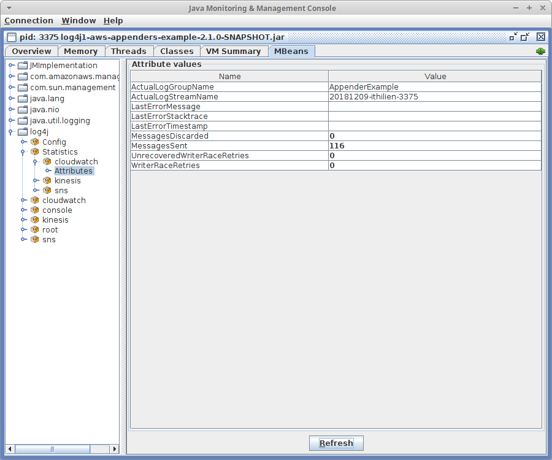

# JMX Support

The appenders will optionally register JMX "statistics beans" with one or more MBeanServers.
These beans provide the following information:

* The post-substitution name of the destination (stream/topic).
* The number of messages that have been successfully sent to the destination.
* The number of messages that have been discarded due to inability to send.
* The most recent error (initialization or runtime), with timestamp and stacktrace.




## Enabling

To enable JMX reporting you must register an instance of `com.kdgregory.log4j.aws.StatisticsMBean`
with one or more MBeanServers. At the same time, you will probably want to register Log4J's
`HierarchyDynamicMBean` so that you can examine and update your application's loggers.

```
ManagementFactory.getPlatformMBeanServer().createMBean(
        HierarchyDynamicMBean.class.getName(),
        new ObjectName("log4j:name=Config"));

ManagementFactory.getPlatformMBeanServer().createMBean(
        StatisticsMBean.class.getName(),
        new ObjectName("log4j:name=Statistics"));
```

The `ObjectName` that you use to register these beans can be anything. The statistics beans will
base their own name on the object name used for `StatisticsMBean`, but the Log4J beans will always
use the `log4j` domain. I find it easier, as here, to use the `log4j` namespace in order to keep
the statistics and configuration together.

> Note: this represents a change from version 1.0 of the appenders, which would also ignore the
  namespace used to register `StatisticsMBean` and instead pick a name that organized the
  statistics beans under the Log4J-managed beans.

The example program, as a stand-alone application, uses the JVM's platform MBeanServer. Depending on
the framework that your application uses, you may want to register with a framework-supplied server
(for example, Spring provides its own server and expects you to
[register your JMX beans](https://docs.spring.io/spring/docs/current/spring-framework-reference/integration.html#jmx)
with the rest of your beans).

If your application explicitly unregisters the `StatisticsMBean`, then the appenders will unregister
themselves from the same server(s). The appenders will also unregister themselves when closed. Normally
you'd never do this: appenders only get closed when the application shuts down or is unloaded.


## Classpath Isolation

Internally, the appenders library maintains the associations between StatisticMBeans, appender MBeans,
and MBeanServers in statically-referenced data structures. This is necessary to avoid the inevitable
race conditions between appender creation and `StatisticMBean` registration without creating explicit
links between them.

To avoid strange JMX behavior -- for example, beans registered under one web-app but not another
running in the same server -- you should load the appenders library in the same classloader as Log4J.
You should do this anyway, to avoid Log4J configuration errors.

## Data Available

Note: the authoritative documentation for each value is maintained as JavaDoc in the MXBean interfaces.
This document provides supplemental information.

All log writers support the following attributes:

* `MessagesSent`  
  The number of messages successfully written to the destination.
* `MessagesDiscarded`  
  The number of messages that have been discarded by the writer due to queue backlog.
  Note `CloudWatchAppender` resets this value each time the logstream is rotated.
* `LastErrorMessage`  
  The last error message generated by the writer, if any. This normally contains an exception name and
  message, but may be a more generic error such as "initialization failure", and may not have an
  associated exception.
* `LastErrorTimestamp`  
  The time that the last writer error occurred, if any.
* `LastErrorStacktrace`  
  The stacktrace from the last writer error, if it involved an exception.

`CloudWatchLogWriter` provides the following additional attributes, defined by
[CloudWatchWriterStatisticsMXBean](../aws-shared/src/main/java/com/kdgregory/logging/aws/cloudwatch/CloudWatchWriterStatisticsMXBean.java):

* `ActualLogGroupName`  
  The actual destination log group name, after subsitutions have been applied to the configured name.
* `ActualLogStreamName`  
  The actual destination log stream name, after subsitutions have been applied to the configured name.
* `WriterRaceRetries`  
  The number of batches that retried due to `InvalidSequenceTokenException`. See
  [this](cloudwatch.md#invalidsequencetokenexception-and-logstream-throttling) for more information.
* `getUnrecoveredWriterRaceRetries`  
  The number of batches that were requeued due to repeated `InvalidSequenceTokenException` responses.

`KinesisLogWriter` provides the following additional attributes, defined by
[KinesisWriterStatisticsMXBean](../aws-shared/src/main/java/com/kdgregory/logging/aws/kinesis/KinesisWriterStatisticsMXBean.java).

* `ActualStreamName`  
  The actual destination stream name, after subsitutions have been applied to the configured name.

`SNSLogWriter` provides the following additional attributes, defined by
[SNSWriterStatisticsMXBean](../aws-shared/src/main/java/com/kdgregory/logging/aws/sns/SNSWriterStatisticsMXBean.java).

* `ActualTopicName`  
  The actual destination topic name, after subsitutions have been applied to the configured name.
* `ActualTopicArn`  
  The actual destination topic ARN, either looked up from the actual topic name, or after subsitutions
  have been applied to the configured ARN.
